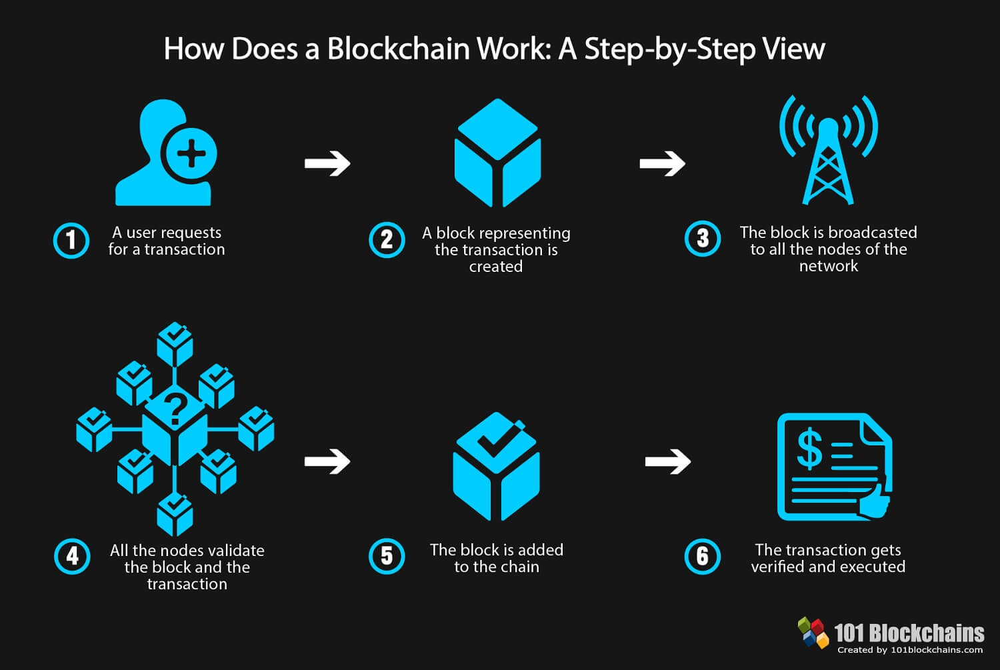

# SupplyBlocks

Integrates Blockchain Technology with Supply-Chain

---

## Introduction 

In today's world, supply-chain is an integral part of our daily lives. Whether its buying basic groceries from the supermarket or ordering a fancy item from your famous online retailers like Amazon, everything functions as seamlessly as it does only because every part in the supply-chain is functioning optimally and to its expected efficiency. 

In this intricate weave of connections that consists in the supply-chain network, the key area of concern comes in the form of security 
where traditional systems using archaic and centralized servers become vulnerable because of attacks like DDOS, SYN/UDP Floods and others which can potentially lead to server crashes and cost companies billions in revenue.

Also traditional username and password security can lead to vulnerabilities due to people using same passwords over multiple platforms and hackers often using this to their advantage and causing leaks to potentially put all of the platforms at risk that the user was connected to using that passphrase.

To ameliorate the standard of security and authentication we present the combination of Blockchain technology's with Supply-chain which potentially aims too rectify all the issues we faced in the traditional system.

## Why Blockchain?

Many people would debate if blockchain is the right technology to combine with the supply-chain due to its association with Bitcoin which doesn't have the best reputation when it comes to speed, efficiency and general robustness.

By far, it is clear to everyone that has followed Blockchain that it 5 main advantages when compared to traditional databases:

* Decentralization
* Security
* Immutability
* Transparency
* Smart Contracts

These 5 pillars define blockchain and make it one of the most secure data structures to maintain data while also providing sauperior security through hashing algorithms and digital signatures along with providing automation through the use of Smart Contracts which effectively eliminates the need for involving 3rd Parties.

But along with these features comes the cost of speed, performance and scalability which is the achilles heel when it comes to blockchain based systems and transactions.

## Proposed Improvements

When it comes to blockchain based applications, the time it takes for a transaction to go through a public blockchain and a result to be received by the application can take 3-5 seconds depending on the type of request, the current block difficulty and the consensus algorithm used. 

Due to this delay, it becomes increasingly difficult for the application developers to keep the user engaged and interested in using the application, specially if all aspects of the application use the same chain to verify the transactions.

Furthermore, the problems become more difficult to handle on the side of the miners since they have to mine the block which uses considerable amount of energy specially in consensus algorithm algorithms like PoW (Proof of Work) while also having to maintaining/syncing the whole chain which can go upto huge amounts. Bitcoin’s blockchain is already > 100 GB, while Ethereum’s blockchain size has surpassed 1 TB (as of this writing). 

It’s not just a storage issue for nodes, but a network as well. With larger blockchain sizes, it takes much longer to copy them to new nodes on the network. It can take several hours to days depending on the network bandwidth. 

We propose a hybrid solution to address these issues which aims to integrate the security and robustness of a public blockchain like Ethereum but also maintains respectable transaction speed through the use of a private blockchain with a proprietary consensus algorithm using our own Blockchain Framework called SCAB Framework (Self-Compressing Activity based Blockchain Framework).

### Addressed Issues :

* **Energy Consumption** : For Inventory based transactions we aim to reduce the block creation and submission time through the use of an activity 
	based consensus algorithm and a dynamically adjusting block difficulty to ensure that the nodes active in the network will mine the block as well as sign the block. This helps in maintaining non-repudiation and authenticity. For other transactions which are intended to take time, we make use of the Ethereum Blockchain and its smart-contracts functionality.
	
* **Size** : As mentioned earlier, size can be a major issue when keeping blockchain in sync and storing them for further reference. To tackle this issue we will use the Self-Compressing nature of our SCAB Framework which aims to compress and store earlier transactions into IPFS (Inter Planetary File System) and store its hash both in transactions and a DHT(Decentralized Hash Table ) to maintain historical data of our blockchain state based on factors like time and transaction validity.

* **Interoperability** : Through the use of both Ethereum Blockchain in conjunction with our SCAB framework we aim to increase interoperability between different types of blockchain ecosystems which aims to outweigh the use of traditional databases in these scenarios.
